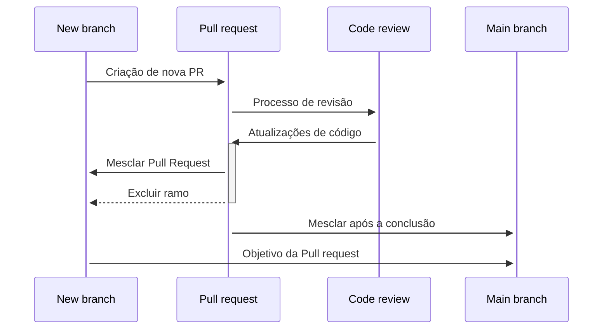

# Pull Requests

As alterações em qualquer código principal - como o ramo principal em um repositório Git, por exemplo - devem ser feitas usando pull requests (PR).

As pull requests possibilitam:

* Inspeção de código - veja [Revisões de Código](./README.md)
* Execução de qualificação automatizada do código
  * Linters (verificadores de código)
  * Compilação
  * Testes unitários
  * Testes de integração, etc.

Os requisitos das pull requests podem e devem ser aplicados por políticas, que podem ser configuradas nos sistemas mais modernos de controle de versão e rastreamento de itens de trabalho. Consulte a seção [Evidência e Medidas](./evidence-and-measures/README.md) para mais informações.

## Processo Geral

1. Implemente as alterações com base na descrição bem definida e nos critérios de aceitação da tarefa em questão.
1. Em seguida, antes de criar uma nova pull request:
    * Certifique-se de que o código esteja em conformidade com as convenções de codificação acordadas
        * Isso pode ser parcialmente automatizado usando linters (verificadores de código)
    * Garanta que o código compile e execute sem erros ou avisos
    * Escreva e/ou atualize os testes para abranger as alterações e certifique-se de que todos os testes novos e existentes passem
    * Escreva e/ou atualize a documentação para corresponder às alterações
1. Uma vez convencido de que os critérios acima estão atendidos, crie e envie uma nova pull request seguindo o [modelo de pull request](pull-request-template/pull-request-template.md)
1. Siga o processo de [revisão de código](./process-guidance/README.md) para mesclar as alterações no código principal

O diagrama a seguir ilustra essa abordagem.



## Orientação de Tamanho

Devemos sempre procurar manter as pull requests pequenas. PRs pequenas têm várias vantagens:

* São mais fáceis de revisar; um benefício claro para os revisores.
* São mais fáceis de implantar; isso está alinhado com a estratégia de lançar rápido e lançar com frequência.
* Minimiza possíveis conflitos e PRs não atualizadas.

No entanto, devemos manter as PRs focadas - por exemplo, em torno de uma funcionalidade funcional, otimização ou legibilidade de código, e evitar PRs que incluam código sem contexto ou frouxamente acoplado. Não há um tamanho certo, mas tenha em mente que uma revisão de código é um processo colaborativo, e PRs grandes podem ser difíceis e, portanto, mais lentas de revisar. Devemos sempre nos esforçar para ter PRs o mais pequenas possível que ainda agreguem valor.

## Melhores Práticas

Além do tamanho, lembre-se de que toda PR deve:

* ser consistente,
* não quebrar a compilação e
* incluir testes relacionados como parte da PR.

Ser consistente significa que todas as alterações incluídas na PR devem visar resolver um objetivo (por exemplo, uma história de usuário) e estar intrinsecamente relacionadas. Pense nisso como o princípio de única responsabilidade em termos do projeto como um todo, a PR deve ter apenas uma *razão para alterar* o projeto.

Comece pequeno, é mais fácil criar uma PR pequena desde o início do que dividir uma maior.

Aqui estão algumas estratégias para manter as PRs pequenas, dependendo da "causa" da inevitabilidade: você pode dividir a PR em alterações autocontidas que ainda agreguem valor, lançar recursos ocultos (consulte feature flag, feature toggling ou lançamentos canários) ou dividir a PR em diferentes camadas (por exemplo, usando padrões de design como MVC ou Observer/Subject). Não importa a estratégia.

## Descrição da Pull Request

Descrições de PR bem escritas ajudam a manter um histórico de alterações limpo e bem estruturado. Embora cada equipe não precise aderir à mesma especificação, é importante que a convenção seja acordada no início do projeto.

Uma especificação popular para projetos de código aberto e outros é a [Conventional Commits specification](https://www.conventionalcommits.org/en/v1.0.0-beta.2/), que é estruturada como:

```txt
<tipo>[escopo opcional]: <descrição>

[corpo opcional]

[rodapé opcional]
```

O `<tipo>` nesta mensagem pode ser selecionado em uma lista de tipos definidos pela equipe, mas muitos projetos usam a [lista de tipos de commit do projeto open-source Angular](https://github.com/angular/angular/blob/22b96b9/CONTRIBUTING.md#type). Deve ficar claro que os elementos `escopo`, `corpo` e `rodapé` são **opcionais**, mas ter um `tipo` obrigatório e uma breve descrição permite as funcionalidades mencionadas acima.

Veja também [Modelo de Pull Request](pull-request-template/pull-request-template.md)

## Recursos

* [Escrevendo uma ótima descrição de pull request](https://www.pullrequest.com/blog/writing-a-great-pull-request-description)
* [Revisando código com pull requests (Azure DevOps)](https://learn.microsoft.com/en-us/azure/devops/repos/git/pull-requests?view=azure-devops)
* [Colaboração com problemas e pull requests (GitHub)](https://help.github.com/en/github/collaborating-with-issues-and-pull-requests)
* [Abordagem do Google para o tamanho de PR](https://google.github.io/eng-practices/review/developer/small-cls.html)
* [Feature Flags](https://www.martinfowler.com/articles/feature-toggles.html)
* [Abordagem do Facebook para recursos ocultos](https://launchdarkly.com/blog/secret-to-facebooks-hacker-engineering-culture/)
* [Abordagem da Azure para lançamentos canários](https://learn.microsoft.com/azure/architecture/framework/devops/release-engineering-cd#stage-your-workloads)
* [Especificação Conventional

 Commits](https://www.conventionalcommits.org/en/v1.0.0-beta.2/)
* [Tipos de Commit do Angular](https://github.com/angular/angular/blob/22b96b9/CONTRIBUTING.md#type)
