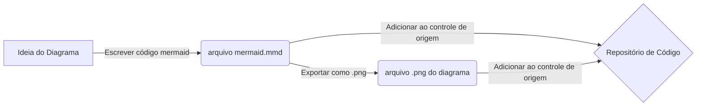

# Linguagens

## Markdown

Markdown é uma das linguagens de marcação mais populares para adicionar formatação rica, tabelas e imagens à sua documentação usando documentos de texto simples.

Arquivos Markdown (.md) podem ser controlados por origem juntamente com seu código.

Mais informações:

- [Começando](https://www.markdownguide.org/getting-started/)
- [Folha de Trapaça](https://www.markdownguide.org/cheat-sheet/)
- [Sintaxe Básica](https://www.markdownguide.org/basic-syntax/)
- [Sintaxe Estendida](https://www.markdownguide.org/extended-syntax/)
- [Sintaxe do Markdown da Wiki](https://learn.microsoft.com/en-us/azure/devops/project/wiki/wiki-markdown-guidance?view=azure-devops)

Ferramentas:

- [Markdown e Visual Studio Code](https://code.visualstudio.com/docs/languages/markdown)
- [Como automatizar verificações simples](./automation.md)

## Mermaid

Mermaid permite que você crie diagramas usando definições de texto que podem ser renderizadas posteriormente com uma ferramenta de diagramação e gráficos.

Arquivos Mermaid (.mmd) podem ser controlados por origem juntamente com seu código. Também é recomendável incluir arquivos de imagem (.png) com os diagramas renderizados sob controle de origem. Seus arquivos Markdown devem vincular os arquivos de imagem, para que possam ser lidos sem a necessidade de uma ferramenta de renderização do Mermaid (por exemplo, durante a revisão de solicitação de pull request).

### Exemplo de diagrama Mermaid

Este é um exemplo de um diagrama de fluxo Mermaid escrito como código.

Este é um exemplo de como ele pode ser renderizado como uma imagem.

Mais informações:

- [Sobre o Mermaid](https://mermaid-js.github.io/mermaid/#/)
- [Sintaxe do Diagrama](https://mermaid-js.github.io/mermaid/#/./n00b-syntaxReference)

Ferramentas:

- [Editor Mermaid Live](https://mermaid.live)
- [Suporte ao Mermaid para Visual Studio Code na Visualização de Markdown](https://marketplace.visualstudio.com/items?itemName=bierner.markdown-mermaid)
